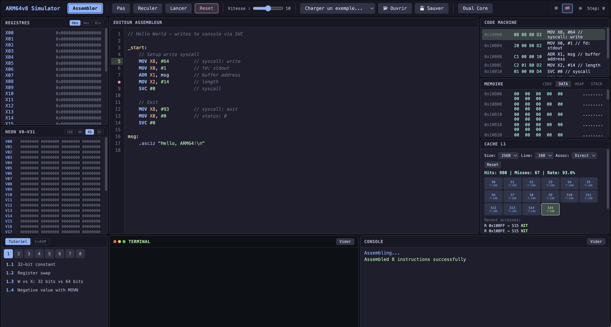

# ARM64v8 Processor Simulator

A browser-based interactive simulator for the ARM64 (AArch64) instruction set, built for learning and teaching assembly programming.

  



## Features

- **Full editor** with syntax highlighting for ARM64 assembly
- **Step-by-step execution** with step-back (undo) support
- **Breakpoints** — click line numbers to set/remove breakpoints
- **Live register view** — X0-X30, SP, PC, flags (N, Z, C, V) with change highlighting
- **NEON/SIMD registers** — V0-V31 with multiple arrangement views (8B, 4H, 2S, 1D)
- **Memory inspector** — code, data, and stack segments with hex/ASCII display
- **Machine code view** — see assembled encodings alongside disassembly
- **Terminal output** — SVC-based console I/O
- **Load file** — import `.s` / `.asm` files from disk
- **Built-in examples** — Fibonacci, factorial, string operations, and more
- **Interactive tutorials** — 25 guided exercises across 8 chapters with hints and auto-checking
- **Keyboard shortcuts** — F5 Run, F10 Step, Shift+F10 Step Back, F9 Breakpoint, Ctrl+Enter Assemble

## Supported Instructions

| Category | Instructions |
|----------|-------------|
| Data movement | `MOV`, `MOVZ`, `MOVK`, `MOVN` |
| Arithmetic | `ADD`, `ADDS`, `SUB`, `SUBS`, `MUL`, `SDIV`, `UDIV`, `MADD`, `MSUB`, `NEG`, `ADC`, `SBC` |
| Logic | `AND`, `ANDS`, `ORR`, `EOR`, `BIC`, `ORN`, `EON`, `MVN` |
| Shift | `LSL`, `LSR`, `ASR`, `ROR` |
| Compare | `CMP`, `CMN`, `TST` |
| Branch | `B`, `B.cond`, `BL`, `BR`, `BLR`, `RET`, `CBZ`, `CBNZ`, `TBZ`, `TBNZ` |
| Load/Store | `LDR`, `STR`, `LDRB`, `STRB`, `LDRH`, `STRH`, `LDRSB`, `LDRSH`, `LDRSW`, `LDP`, `STP` |
| Conditional | `CSEL`, `CSINC`, `CSINV`, `CSNEG`, `CSET`, `CSETM`, `CINC` |
| Address | `ADR`, `ADRP` |
| NEON/SIMD | `LD1`, `ST1`, `DUP`, `INS`, `UMOV`, `MOVI`, `ADDV`, `FADD`, `FSUB`, `FMUL`, `FDIV` |
| System | `SVC`, `NOP`, `BRK`, `MSR`, `MRS` |

## Quick Start

### Browser (no install needed)

Serve the project directory with any HTTP server:

```bash
python3 -m http.server 8080
```

Open `http://localhost:8080` in your browser.

### Standalone Desktop App

```bash
pip install pywebview
python3 app.py
```

## Usage

1. Write or load ARM64 assembly code in the editor
2. Click **Assemble**
3. Use **Step** to execute one instruction at a time, or **Run** for continuous execution
4. Click a **line number** to toggle a breakpoint
5. Use **Step Back** to undo instructions
6. Inspect registers, memory, and flags as you go

## Project Structure

```
.
├── index.html          # Main UI
├── app.py              # Desktop launcher (pywebview)
├── css/styles.css      # Dark theme styles
├── js/
│   ├── main.js         # Entry point
│   ├── cpu/            # CPU, decoder, executor
│   ├── assembler/      # Assembler and encoder
│   ├── ui/             # Editor, registers, memory, toolbar views
│   ├── memory.js       # Memory model (code/data/stack segments)
│   └── registers.js    # Register file (GPR + NEON)
├── examples/           # Built-in example programs
└── tests/              # Test suite
```

## Compatibility

The assembler uses **standard ARM64 syntax**, compatible with both Apple (`as`) and GNU (`gas`) conventions:

- Labels work with or without `_` prefix (`_main:` and `main:` are both valid)
- Both `.globl` and `.global` directives are supported
- NEON/SIMD syntax follows the official ARM notation (`V0.4S`, `V2.S[0]`)
- Comments: `//` and `;` styles
- No platform-specific output — the simulator executes directly, no Mach-O or ELF involved

Code written in this simulator can be assembled on both **macOS (Apple Silicon)** and **Linux ARM64** with minimal changes (mainly entry point and section directives).

## License

Apache License 2.0 — see [LICENSE](LICENSE) for details.
